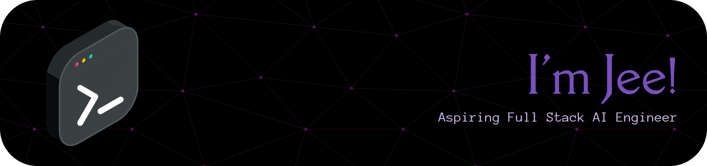

<div>
  


</div>

<div align="center">

---

                       

<!-- Proudly created with GPRM ( https://gprm.itsvg.in ) -->

</div>

<!--START_SECTION:waka-->


**I'm an Early 🐤** 

```text
🌞 Morning                321 commits         ⣿⣿⣿⣿⣿⣀⣀⣀⣀⣀⣀⣀⣀⣀⣀⣀⣀⣀⣀⣀⣀⣀⣀⣀⣀   21.69 % 
🌆 Daytime                487 commits         ⣿⣿⣿⣿⣿⣿⣿⣿⣀⣀⣀⣀⣀⣀⣀⣀⣀⣀⣀⣀⣀⣀⣀⣀⣀   32.91 % 
🌃 Evening                661 commits         ⣿⣿⣿⣿⣿⣿⣿⣿⣿⣿⣿⣀⣀⣀⣀⣀⣀⣀⣀⣀⣀⣀⣀⣀⣀   44.66 % 
🌙 Night                  11 commits          ⣀⣀⣀⣀⣀⣀⣀⣀⣀⣀⣀⣀⣀⣀⣀⣀⣀⣀⣀⣀⣀⣀⣀⣀⣀   00.74 % 
```
📅 **I'm Most Productive on Sunday** 

```text
Monday                   238 commits         ⣿⣿⣿⣿⣀⣀⣀⣀⣀⣀⣀⣀⣀⣀⣀⣀⣀⣀⣀⣀⣀⣀⣀⣀⣀   16.08 % 
Tuesday                  146 commits         ⣿⣿⣀⣀⣀⣀⣀⣀⣀⣀⣀⣀⣀⣀⣀⣀⣀⣀⣀⣀⣀⣀⣀⣀⣀   09.86 % 
Wednesday                208 commits         ⣿⣿⣿⣿⣀⣀⣀⣀⣀⣀⣀⣀⣀⣀⣀⣀⣀⣀⣀⣀⣀⣀⣀⣀⣀   14.05 % 
Thursday                 216 commits         ⣿⣿⣿⣿⣀⣀⣀⣀⣀⣀⣀⣀⣀⣀⣀⣀⣀⣀⣀⣀⣀⣀⣀⣀⣀   14.59 % 
Friday                   192 commits         ⣿⣿⣿⣀⣀⣀⣀⣀⣀⣀⣀⣀⣀⣀⣀⣀⣀⣀⣀⣀⣀⣀⣀⣀⣀   12.97 % 
Saturday                 229 commits         ⣿⣿⣿⣿⣀⣀⣀⣀⣀⣀⣀⣀⣀⣀⣀⣀⣀⣀⣀⣀⣀⣀⣀⣀⣀   15.47 % 
Sunday                   251 commits         ⣿⣿⣿⣿⣀⣀⣀⣀⣀⣀⣀⣀⣀⣀⣀⣀⣀⣀⣀⣀⣀⣀⣀⣀⣀   16.96 % 
```


📊 **This Week I Spent My Time On** 

```text
💬 Programming Languages: 
TypeScript               12 hrs 4 mins       ⣿⣿⣿⣿⣿⣿⣿⣿⣿⣿⣿⣿⣿⣿⣿⣿⣿⣀⣀⣀⣀⣀⣀⣀⣀   66.09 % 
Markdown                 1 hr 26 mins        ⣿⣿⣀⣀⣀⣀⣀⣀⣀⣀⣀⣀⣀⣀⣀⣀⣀⣀⣀⣀⣀⣀⣀⣀⣀   07.90 % 
JavaScript               1 hr 8 mins         ⣿⣿⣀⣀⣀⣀⣀⣀⣀⣀⣀⣀⣀⣀⣀⣀⣀⣀⣀⣀⣀⣀⣀⣀⣀   06.22 % 
JSON                     1 hr 3 mins         ⣿⣀⣀⣀⣀⣀⣀⣀⣀⣀⣀⣀⣀⣀⣀⣀⣀⣀⣀⣀⣀⣀⣀⣀⣀   05.75 % 
CSS                      52 mins             ⣿⣀⣀⣀⣀⣀⣀⣀⣀⣀⣀⣀⣀⣀⣀⣀⣀⣀⣀⣀⣀⣀⣀⣀⣀   04.78 % 
```

🤖 **AI Coding This Week** 

```text
⏱ AI Coding Time: 5 hrs 12 mins (28.5%)

✍️ 1,604 lines written by AI, 1,416 lines written by hand (53.11% AI-written)

🔤 4,901,558 Input Tokens, 727,097 Output Tokens

💵 $284.41 Estimated AI Cost This Week

🧠 16 AI Sessions, 38 AI Prompts

Deepseek                 1,612 lines         ⣿⣿⣿⣿⣿⣿⣿⣿⣿⣿⣿⣿⣿⣿⣿⣿⣿⣿⣿⣿⣿⣿⣿⣀⣀   92.96 % 
S                        108 lines           ⣿⣿⣀⣀⣀⣀⣀⣀⣀⣀⣀⣀⣀⣀⣀⣀⣀⣀⣀⣀⣀⣀⣀⣀⣀   06.23 % 
Github-Copilot           14 lines            ⣀⣀⣀⣀⣀⣀⣀⣀⣀⣀⣀⣀⣀⣀⣀⣀⣀⣀⣀⣀⣀⣀⣀⣀⣀   00.81 % 
Opencode-Cli             0 lines             ⣀⣀⣀⣀⣀⣀⣀⣀⣀⣀⣀⣀⣀⣀⣀⣀⣀⣀⣀⣀⣀⣀⣀⣀⣀   00.00 % 

🔎 AI Coding Insights:
⚖️ Balanced with AI — 53.11% of written lines came from AI
📄 Detailed Prompter — average 614 characters per prompt
🔁 Iterative Prompter — average 2 prompts per session
🔍 Hands-On Reviewer — 55.87% of changed lines were hand-edited
```


 Last Updated on 20/08/2026 00:58:09 UTC
<!--END_SECTION:waka-->
